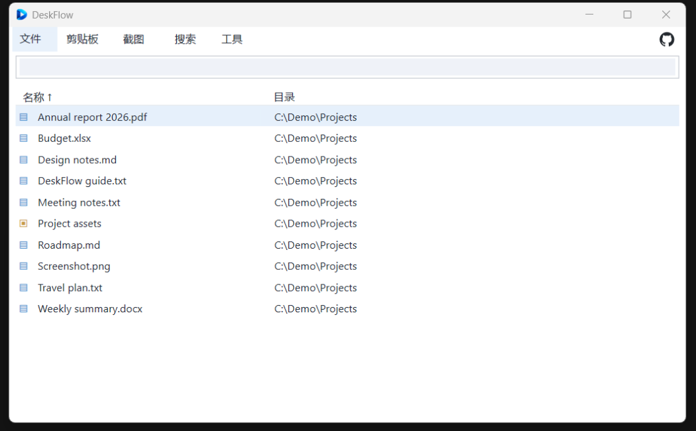
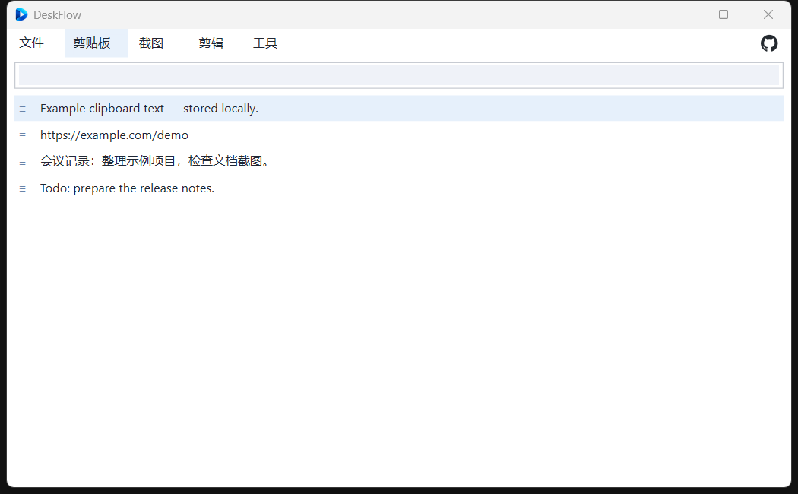
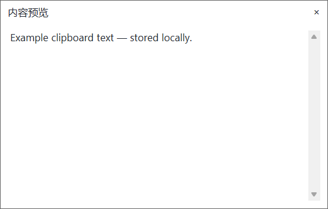
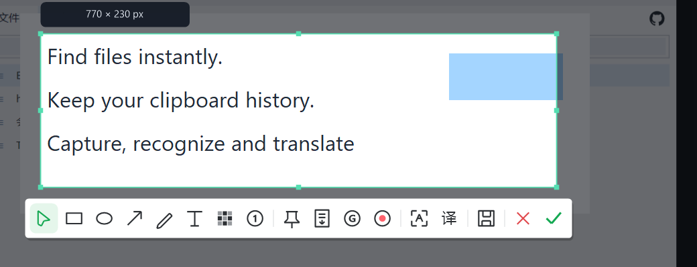
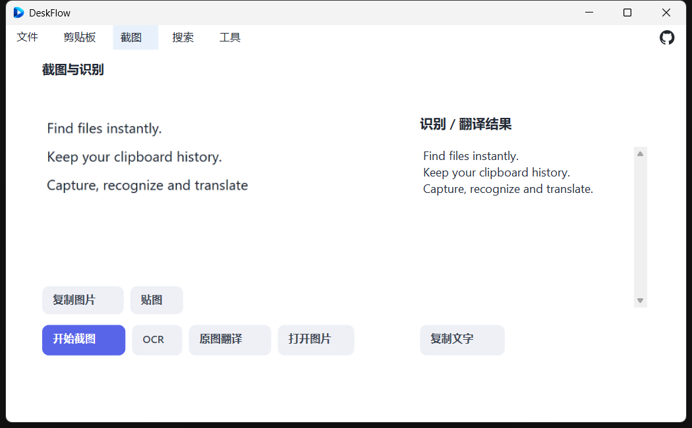
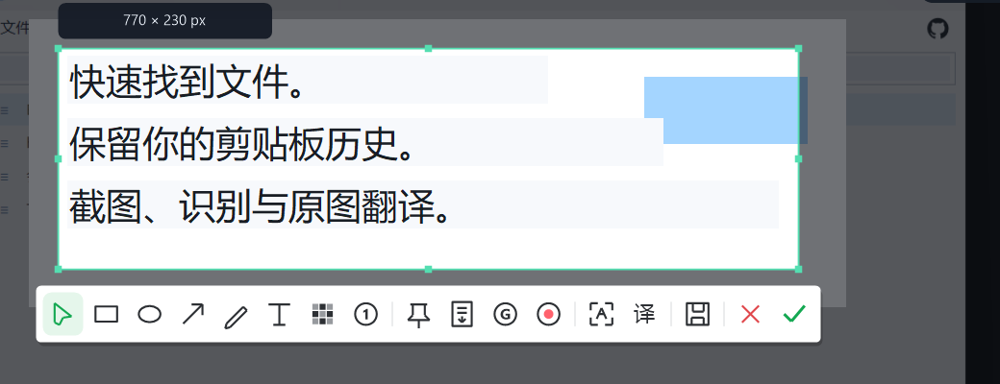
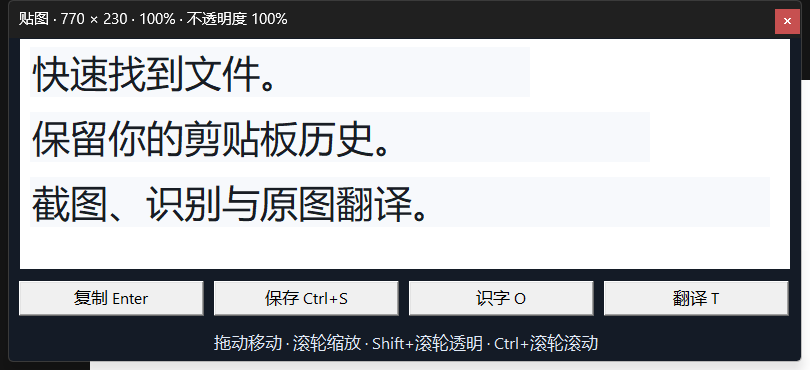
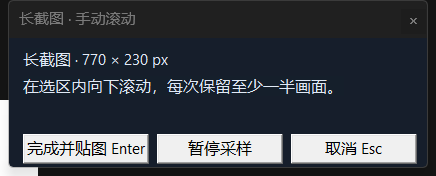
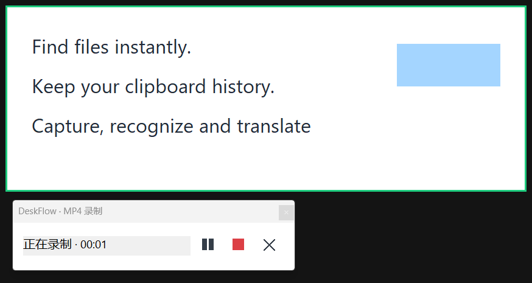

# DeskFlow user guide

[简体中文](USER_GUIDE.zh-CN.md) · [Project overview](../README.md)

DeskFlow combines independent file search, persistent clipboard history, and capture/OCR/image translation in a native Windows tray application. All documentation screenshots use synthetic data.

## Start using DeskFlow

Windows 10 version 2004 or later and Windows 11, with x64, x86 and ARM64 builds. ARM64 validation uses Windows 11 on Arm. Most Intel/AMD PCs use x64; 32-bit Windows uses x86; Windows on Arm uses ARM64.

Download the matching architecture from [Releases](https://github.com/middletoo/DeskFlow/releases). Extract the portable archive and run `DeskFlow.exe`. For local OCR/image translation, extract the setup archive and run `Install-DeskFlow.cmd`. The first installation may ask for UAC to trust the pinned development certificate; no private key is distributed. Launch the installed app from Start. Closing the main window returns it to the tray; use the tray menu to exit completely. See [Development](DEVELOPMENT.md) for source builds. OCR also needs Windows language resources.

| Function | Default hotkey |
| --- | --- |
| File search | Alt+Q |
| Clipboard history | Alt+W |
| Screenshot | Alt+S |

Hover over a top function entry to see its current hotkey. Change keys in Tools → Settings. Conflicts are reported; the main window and tray remain available.

## Find files

Press Alt+Q and enter a filename. Spaces combine terms with AND, for example `report 2026`. Names are matched by default; enable full-path matching in Search to include parent directories. Use `ext:pdf`, `ext:pdf;docx`, `type:folder` or `in:C:\Demo` to narrow results. `*` and `?` are wildcards; `regex:` enables the supported basic expressions.

Click column headers to sort. Name and directory are shown by default; optional type/size columns are in Search. Scrolling loads subsequent results, with a bounded row cache and disk checkpoints for revisiting earlier rows.

- Double-click a name to reveal that file in Explorer.
- Double-click its directory cell to copy the full file path, including its name.
- Enter opens; Ctrl+Enter reveals; Ctrl+Shift+C copies paths.
- Ctrl/Shift select multiple files; Ctrl+C/X copy/cut, F2 renames and Delete uses the Recycle Bin.
- Use the Windows context menu or drag selected items out. Export and preview are in Search.

The initial independent index builds in the background; existing entries remain searchable. See Tools → Index and runtime status. Settings provides optional elevated NTFS indexing for protected directories, with Windows UAC confirmation.

## Keep clipboard history

Text, images, HTML/RTF and file lists are stored on disk in their original formats, without automatic age-based deletion. Adjacent duplicates are suppressed and content is loaded on demand.

Click an entry for a floating preview. Text is selectable and scrollable; images use bounded thumbnails. Unsupported representations show source, timestamp, size and format information. The preview does not activate over your target application.

Press Alt+W, then Enter to paste into the previous window. Ctrl+C copies and Ctrl+D pins an entry. The Edit/context menu provides plain text copy, filters, deletion and pause recording; image entries also offer OCR, translation and pinning. File lists retain copy/cut intent but do not back up the referenced files.

Defaults are 32 MiB per entry and a 5 GiB image-storage budget, configurable in Settings. Storage errors are reported while existing records remain intact. Password-manager sources are excluded by default; add other exclusions as needed.

## Capture and annotate

Press Alt+S. Hover to select a window or drag a region. Rectangle, ellipse, arrow, pen, text, mosaic and numbered annotations are available, with contextual color/width controls. The green check to the right of the red cross copies the screenshot.

| Action | Shortcut |
| --- | --- |
| Copy / save | Enter / Ctrl+S |
| Undo / redo | Ctrl+Z / Ctrl+Y or Ctrl+Shift+Z |
| OCR / image translation | O / T |
| Pin / scrolling capture | P / L |
| GIF / MP4 | G / M |
| Cancel | Esc |

## Recognize text locally

Press O in a selection. Windows OCR runs in an isolated on-demand process; Chinese/English resources come from the system. Long images use overlapping tiles with restored coordinates. Select, scroll and copy results. The capture panel also accepts an image file or Ctrl+V image import.

Missing package identity/language resources or poor image quality produce an explicit error; retry with a clear text region.

## Translate within the image

Press T. Translated text replaces corresponding areas while the capture editor stays open. Hold Space for the original. Continue annotating, copying, saving or pinning the translated image.

Tools → Settings supports the experimental free Google channel, DeepL API Free/Pro, official Google API and LibreTranslate. API keys use Windows DPAPI protection. The default target language is Chinese.

OCR is local; only recognized text is sent to the selected provider. Experimental free endpoints require connectivity and may change or rate-limit. Failed requests are not automatically forwarded elsewhere. Complex backgrounds or lengthy translations can require smaller text or clipping.

## Pin and capture long content

Press P for a floating always-on-top image. Drag to move, wheel to zoom, Shift+wheel for opacity and Ctrl+wheel to scroll. Copy, save, OCR and translation remain available; Esc/double-click closes it.

Press L and scroll downward manually inside the region, keeping at least half a screen of overlap. Reliable overlap is stitched; Enter finishes into a pin and Esc cancels. Fixed headers or ambiguous overlap pause capture. Limits: 32 MP, 32768 pixels tall and 15 minutes.

## Record GIF or video with playback audio

GIF/MP4 starts immediately. The control bar shows elapsed time, pause/resume, the red stop square and cancel. Stop first, then choose a filename/location. Canceling that save dialog retains the clip and offers save retry. Canceling the recording or exiting completely removes temporary media.

**MP4 includes system playback audio by default**, such as a browser livestream, video or music on the default output endpoint. It does not open the microphone. Pause stops both audio and video, excluding the paused interval. Disconnecting/changing the output device can require restarting capture.

GIF has no audio; use MP4 for livestream sound. Recording streams to temporary storage rather than retaining all frames in RAM. GIF: 10 FPS; MP4: H.264/AAC at 15 FPS; up to 1920×1080 and 10 minutes.

## Data, backup and privacy

Tools → Open data directory reveals the current user's storage. `history.db` plus `objects/` form the history; `files.db` is a rebuildable index. Updates preserve package-family storage. Back up into a new directory. Exit before restoring and preserve the old data directory; do not copy an actively written database. Encrypted attachments need a backup location supporting their file encryption.

The public repository excludes personal data, real history, API keys, private signing keys, validation backups and local development history. Screenshots show synthetic content on a private desktop. Actual system audio recordings are not published.

## Practical limits

This is a validation release. Search does not implement every Everything expression; the initial index takes time. Image work is bounded by a shared memory budget. Complex translation layouts, mixed-DPI monitors and HDR need further device testing. No claim is made of crash-free multi-year use or Everything-equivalent performance at every scale.
