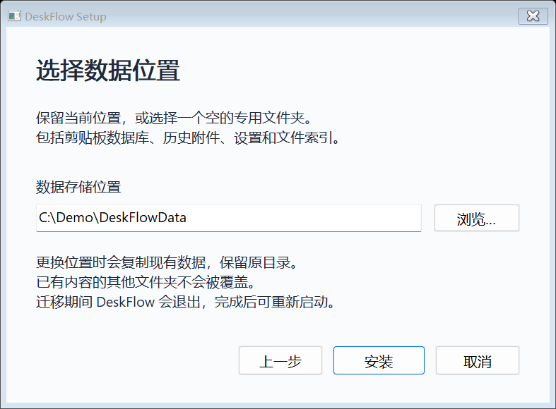
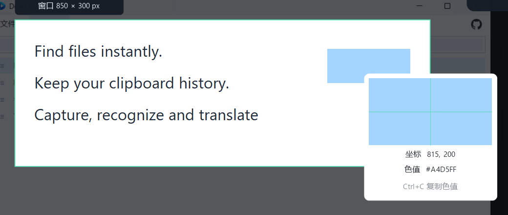

# DeskFlow 使用指南

[English](USER_GUIDE.en-US.md) · [项目首页](../README.md)

DeskFlow 是 Windows 原生桌面工具，将独立文件搜索、永久剪贴板历史、截图/OCR/原图翻译整合在一个托盘程序中。以下截图全部使用合成数据。

## 开始使用

适用于 Windows 10 2004 或更高版本、Windows 11，提供 x64、x86 和 ARM64 构建，ARM64 在 Windows 11 on Arm 上验证。多数 Intel/AMD 电脑选 x64，32 位 Windows 选 x86，Windows on Arm 选 ARM64。

从 [Releases](https://github.com/middletoo/DeskFlow/releases) 下载对应架构的 `setup.exe`，双击进入安装向导。按“下一步”，保留当前数据目录或选择空的专用文件夹，点击“安装”，完成后可启动程序或创建桌面快捷方式。`setup.zip` 解压后运行 `DeskSetup.exe`，也可使用 `Install-DeskFlow.cmd` 入口。

数据目录包括剪贴板数据库、历史附件、设置和文件索引，可选择其他本地磁盘；程序安装位置由 Windows 的 MSIX 管理。更换位置时工具会退出，使用 SQLite 快照复制数据库并保留原目录。目标不得是磁盘根目录、网络路径、已有内容的其他文件夹，或与源目录互相包含。加密文件需要支持 EFS 的目标磁盘。以后重新运行向导即可更改位置；安装版和便携版共享向导选定的位置。

首次安装可能请求 UAC 来信任固定开发者证书，私钥不在下载包中。安装后从开始菜单启动，关闭主窗口收回托盘，托盘菜单可完全退出。便携版完整解压后运行 `DeskFlow.exe`；本地 OCR / 原图翻译需要安装版和系统语言资源。源代码构建见 [开发指南](DEVELOPMENT.md)。

| 功能 | 默认快捷键 |
| --- | --- |
| 文件搜索 | Alt + Q |
| 剪贴板历史 | Alt + W |
| 截图 | Alt + S |

鼠标悬停顶部功能入口会显示当前快捷键；在“工具 → 设置”中可更换。与其他软件冲突时会提示，主界面和托盘入口仍可用。

右上角 GitHub 图标打开当前项目页面。工具以低负担常驻为目标：数据存磁盘、缓存有界、后台索引分时让出 CPU，OCR 与编码按需启动。具体测试场景和测量值见 [性能说明](PERFORMANCE.md)。

## 文件搜索

按 Alt+Q 输入文件名。空格表示多个词同时匹配，例如 `report 2026`；默认搜索名称，“搜索 → 匹配完整路径”也可匹配父目录。输入 `ext:pdf`、`ext:pdf;docx`、`type:folder`、`in:C:\Demo` 限定范围。`*`/`?` 是通配符，基础正则使用 `regex:`。

默认显示名称、目录、大小和修改时间；修改时间使用本地时区，文件夹大小栏留空。点击列标题可对完整结果排序，额外类型列在搜索菜单开启。旧索引的修改时间后台补齐，暂不可读取的文件元数据显示“—”。向下滚动自动续载，界面缓存有界，向上回看重新读取早先条目。

- 双击名称：在资源管理器定位该文件。
- 双击目录：复制该文件完整路径，包含名称。
- Enter：打开；Ctrl+Enter：定位；Ctrl+Shift+C：复制路径。
- Ctrl/Shift 多选，Ctrl+C/X 复制/剪切，F2 重命名，Delete 进入回收站。
- 右键使用系统菜单，选中项可以拖出；搜索菜单提供导出、预览和其他操作。

首轮全盘索引在后台建立，已有条目可立即查。状态位于“工具 → 索引与运行状态”。新安装默认请求管理员权限运行索引进程，主界面保持普通权限；系统显示 UAC，取消后按当前权限继续。已有明确保存的设置保留，可在设置中切换。NTFS 使用 MFT/USN，其他情况回退到目录扫描；未完成的扫描在重启后续建。

## 剪贴板历史

文字、图片、HTML/RTF 和文件列表按原始格式保存在磁盘，不按年龄自动删除。相邻重复内容去重；数据库与附件按需读取。

点击条目打开浮动预览。文本可选择和滚动，图片显示有界缩略图；不能呈现的格式显示来源、时间、大小和格式信息。预览不会主动切换前台应用。

按 Alt+W 唤出，Enter 粘贴到唤出前的窗口，Ctrl+C 只复制，Ctrl+D 收藏。剪辑及右键菜单提供纯文本复制、类型筛选、删除、暂停记录，图片条目还支持 OCR、翻译及贴图。文件列表保留复制/剪切意图，不备份路径指向的文件本身。

默认单条上限 32 MiB、图片存储预算 5 GiB，可在设置更改。容量或存储错误会提示，原记录保留。密码管理器等来源默认排除，可配置更多来源。

## 截图与标注

按 Alt+S，悬停可选窗口，拖动可框选。矩形、圆形、箭头、画笔、文字、马赛克和序号工具可叠加，颜色和粗细按需显示。红叉右侧的绿色勾复制截图。

文字输入后确认，单击已写文字并拖动可移动位置，双击文字可重新编辑，取消编辑保留原文。移动、编辑和清空文字均可撤销/重做。文字可移动到选区内的新位置。

确定选区后，阴影区域点击或拖动不会重启框选；选区仍可移动和调整边缘。要换一张截图，请按 Esc 或红叉关闭，再按 Alt+S 重新框选。

未按左键时，绿色预选框随鼠标匹配所在应用窗口；单击选定当前窗口，拖动可自定义区域。放大镜同步显示物理像素坐标和原始截图的 HEX 色值，同一窗口内移动也刷新。此时 Ctrl+C 复制色值并保持截图浮层打开。

| 操作 | 快捷键 |
| --- | --- |
| 复制 / 保存 | Enter / Ctrl+S |
| 撤销 / 重做 | Ctrl+Z / Ctrl+Y 或 Ctrl+Shift+Z |
| 识别 / 原图翻译 | O / T |
| 贴图 / 长截图 | P / L |
| GIF / MP4 | G / M |
| 取消 | Esc |

## 本地 OCR

选区点击识别或按 O。Windows OCR 在独立按需进程中运行，中文/英文资源来自系统；长图分块识别并恢复坐标。结果可选中、滚动、复制。也可从截图面板打开图片或 Ctrl+V 导入图片。

小图在像素预算内放大，透明背景合成、深色背景反色、低对比度增强按需处理；超宽图使用带重叠的二维分块，避免整体缩小丢失文字。英文画面可使用英文识别模型，增强过程保留可匹配的原始中文结果。

极小汉字、低清图片、特殊字体和复杂背景仍可能误识。优先选择原始分辨率、清晰且紧凑的文字区域；复制或翻译前校对。预处理不代表任意截图都能准确识别。

语言资源、包身份或图片质量不足会显示原因，重新选择清晰文字区域可重试。

## 原图翻译

选区按 T，译文覆盖对应文字位置，截图浮层保持打开。按住 Space 对照原图，仍可继续标注、复制、保存或贴图。

“工具 → 设置”提供 Google 免费实验通道、DeepL API Free/Pro、Google 官方 API 和 LibreTranslate。DeepL 等 Key 使用 Windows DPAPI 保护。默认目标语言为中文。

OCR 在本机完成，翻译只发送识别后的文本给选定服务。免费实验通道依赖网络且可能变化/限流，工具不自动切换服务转送失败请求。复杂背景和长译文可能缩小或裁切。

## 贴图与长截图

按 P 将截图置顶，拖动移动，滚轮缩放，Shift+滚轮调透明度，Ctrl+滚轮滚动。窗口支持复制、保存、识别和翻译；Esc/双击关闭。

按 L 后在选区内手动向下滚动，每次保留至少一半重叠。工具按可信重叠拼接，Enter 完成到贴图，Esc 取消。固定页头、无可靠重叠时会暂停。上限为 32 MP、32768 高度和 15 分钟。

## GIF 与有声视频

点击 GIF / MP4 后直接录制。控制条显示时间、暂停/继续、红色停止方块和取消。停止后选择位置和文件名；取消保存对话框会保留本段录制，图标变为保存，可重试。取消录制或完全退出会清理临时文件。

录制区域持续显示绿色范围框，暂停变为琥珀色；边框不拦截鼠标操作，也不进入录制画面。停止后边框立即隐藏。

**MP4 默认包含当前系统播放声音**，可录入网页直播、视频、音乐等默认输出设备的声音，不开启麦克风。暂停同时暂停声音与画面，暂停时间不计入媒体时间。默认输出设备被断开/更换时可能需要重新开始录制。

GIF 不支持声音；需要直播音频请保存为 MP4。录制采用流式临时文件，内存不会保存全部帧。GIF 10 FPS、MP4 H.264/AAC 15 FPS，画面最大 1920×1080、最长 10 分钟。

## 数据、备份和隐私

“工具 → 打开数据目录”打开当前用户数据位置。`history.db` 与 `objects/` 是历史，`files.db` 是可重建的索引。安装更新沿用原包家族的数据。备份请使用新目录，恢复前完全退出并保留旧数据目录；不要直接复制正在写入的数据库。加密附件的备份目标应支持相同文件加密。

代码仓库不包含个人数据、真实历史、API Key、证书私钥、验证备份或本地开发提交历史。文档图片是私人桌面上的合成示例；录制示例不公开实际系统音频。

## 实际边界

软件当前为验证版。独立搜索并非 Everything 全部语法兼容层；首轮索引需要时间。图片处理受总内存预算约束；复杂翻译版面、混合 DPI 多屏和 HDR 仍需更多设备验证。没有“运行数年永不崩溃”或“任何规模等同 Everything”的保证。
